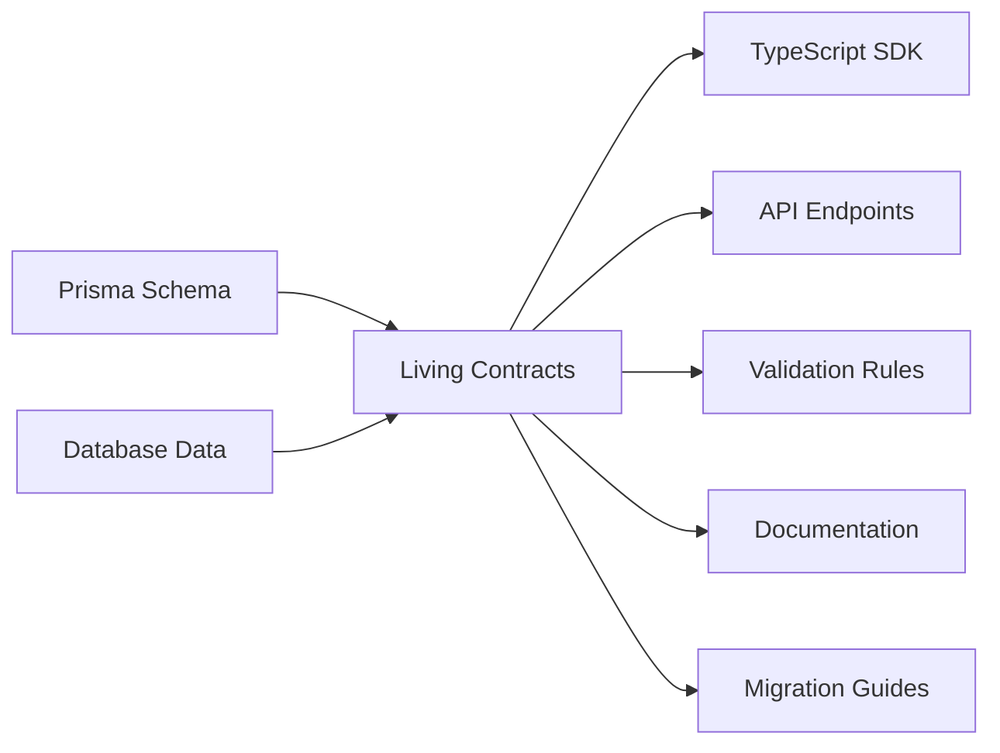

# Living Contracts 🔄

> **Never let your API drift from your database schema again.** Living Contracts watches your Prisma schema and automatically generates type-safe APIs, SDKs, validation rules, and documentation that evolve with your data.

[](https://www.npmjs.com/package/living-contracts)
[](https://opensource.org/licenses/MIT)
[](http://makeapullrequest.com)

## The Problem

Every TypeScript developer knows this pain:

```typescript
// Monday: Backend updates the schema
model User {
  username String
  email String
  phoneNumber String? // NEW FIELD
}

// Wednesday: Frontend breaks in production
// TypeScript types? Outdated.
// API docs? Still showing old schema.
// Validation? Rejecting the new field.
```

## The Solution

Living Contracts creates a **living connection** between your database and your entire API surface:

```bash
npx living-contracts watch

✨ Watching schema.prisma...
📝 Schema change detected!
🔄 Regenerating TypeScript SDK...
🔄 Updating API endpoints...
🔄 Learning validation rules from data...
📚 Updating documentation...
✅ Everything in sync!
```

## Features

### 🧠 **Intelligent Validation**

Instead of guessing validation rules, Living Contracts learns from your actual data:

```typescript
// Analyzes your database and discovers:
username: string  // 4-28 chars, lowercase, allows underscores
email: string     // valid emails, max 255 chars
price: number     // 0.99-9999.99, always 2 decimal places
```

### 🚨 **Breaking Change Detection**

Know exactly what breaks before you deploy:

```
⚠️  Breaking Change Detected!
Field renamed: username → userName

Affected:
- 17 API endpoints
- 43 frontend components
- 3 mobile apps

📋 Migration guide generated with AI assistance
```

### 🔄 **Always in Sync**

- **TypeScript SDK** - Type-safe client with perfect IntelliSense
- **API Endpoints** - REST/GraphQL endpoints that match your schema
- **Validation** - Zod schemas based on real data patterns
- **Documentation** - Always current, never lies
- **Tests** - Generated from actual usage patterns

## Quick Start

```bash
# Install globally
npm install -g living-contracts

# Or use npx
npx living-contracts init
```

### Setup in your project

```bash
# In your Prisma project
living-contracts init

# Start watching for changes
living-contracts watch
```

### Use the generated SDK

```typescript
// Import your auto-generated, type-safe SDK
import { api } from './generated/sdk'

// Perfect IntelliSense, always up-to-date
const user = await api.users.create({
  username: 'alice',     // ✅ Validates: 4-28 chars
  email: 'alice@example.com',
  phoneNumber: '+1234567890'  // ✅ New field already typed!
})
```

## How It Works



1. **Watches** your Prisma schema for changes
1. **Analyzes** your actual database data to infer patterns
1. **Generates** everything you need for a type-safe API
1. **Detects** breaking changes before they break
1. **Guides** migrations with AI-powered suggestions

## CLI Commands

```bash
living-contracts init          # Initialize in your project
living-contracts generate      # One-time generation
living-contracts watch         # Watch mode (recommended)
living-contracts validate      # CI/CD validation
living-contracts analyze       # Analyze data patterns
```

## Configuration

`.living-contracts.json`:

```json
{
  "output": "./generated",
  "generators": ["sdk", "api", "validation", "docs"],
  "watch": true,
  "inferValidation": true,
  "ai": {
    "provider": "openai",
    "model": "gpt-4"
  }
}
```

## Example Output Structure

```
generated/
├── sdk/
│   ├── index.ts         # Type-safe client
│   ├── types.ts         # Generated TypeScript types
│   └── client.ts        # API client with React Query hooks
├── api/
│   ├── users.ts         # User endpoints
│   └── [...].ts         # Other model endpoints
├── validation/
│   └── schemas.ts       # Zod validation schemas
└── docs/
    └── api.md           # Auto-generated API documentation
```

## Advanced Features

### Custom Generators

```typescript
// .living-contracts.config.ts
export default {
  generators: {
    custom: async (schema, data) => {
      // Your custom generation logic
    }
  }
}
```

### Hooks

```json
{
  "hooks": {
    "beforeGenerate": ["npm run lint:fix"],
    "afterGenerate": ["npm run test:generated"]
  }
}
```

### Multi-Database Support

```bash
living-contracts generate --schema ./tenant1/schema.prisma
living-contracts generate --schema ./tenant2/schema.prisma
```

## Roadmap

- [x] TypeScript SDK generation
- [x] Validation inference from data
- [x] Breaking change detection
- [ ] GraphQL support
- [ ] Python/Go/Java SDKs
- [ ] VS Code extension
- [ ] GitHub Actions integration
- [ ] Team collaboration features

## Contributing

We love contributions! Please see our [Contributing Guide](CONTRIBUTING.md) for details.

```bash
# Clone the repo
git clone https://github.com/yourusername/living-contracts
cd living-contracts

# Install dependencies
npm install

# Run tests
npm test

# Build
npm run build
```

## Why “Living Contracts”?

Traditional API contracts are static documents that drift from reality. Living Contracts are **alive** - they grow and evolve with your application, always reflecting the truth of your data.

## License

MIT © 2025

-----

Built with ❤️ by developers who were tired of API drift.